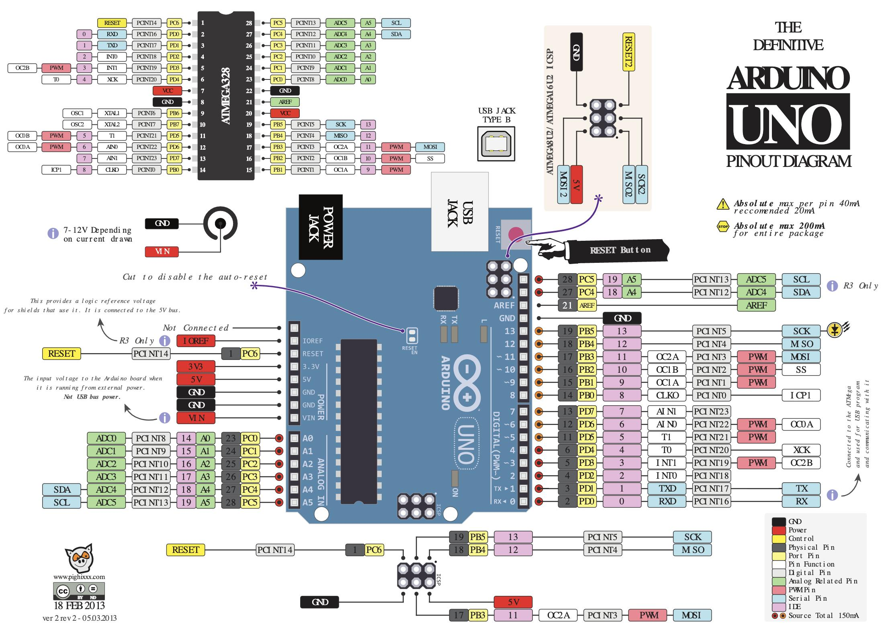

# PO_KlokWave

## Altium

### BOM: [Info/README.md]
### PIN mapping Arduino - ATMEGA
Gebruikt voor logica te programmeren.
https://www.circuito.io/blog/arduino-uno-pinout/

### 8-Bit schuifregister
Gebruikt om aantal I/O pinnen in gebruikt van ATMEGA.
- hardwaretest met 7-segment display (/Tests)

### Alarm (clock/ATMEGA output PB2)

Video tutorial BC547: https://www.youtube.com/watch?v=-o46f7fIX9A

 

## Autodesk / 3D.Design

The design needs 2 types of holes:
- Power Supply
- Scew holes for PCB and lid

Lid is made of "~ invisible" plastic.
